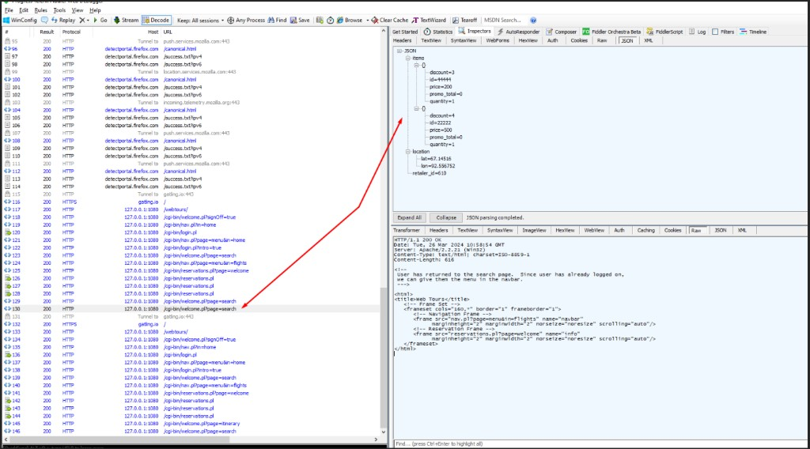
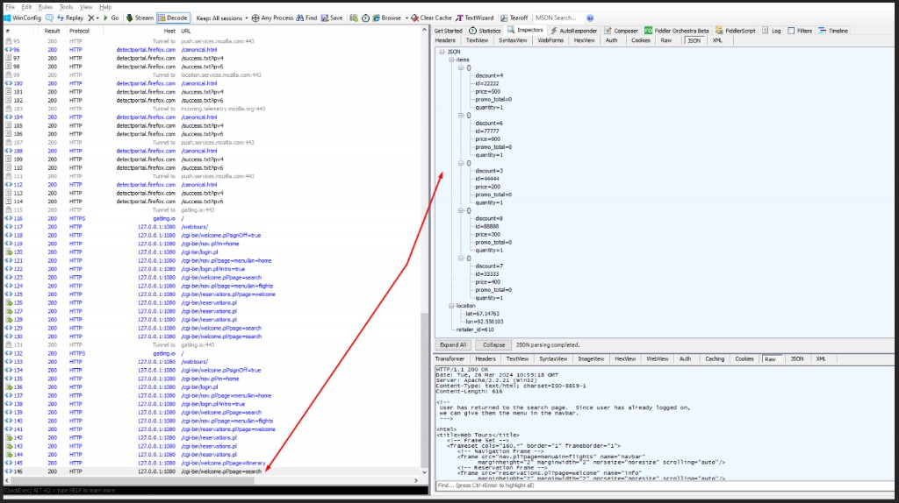

<a id="readme-en"></a>

# gatling-webtours-demo

Learning material for **Gatling**: an **HP WebTours** demo scenario and **bash automation on Linux** (Git + official Gatling bundle, test runs, reports).

**Repository:** [github.com/GeorgeKalyaev/gatling-webtours-demo](https://github.com/GeorgeKalyaev/gatling-webtours-demo)

**[Русская версия документации](#readme-ru)** — the same documentation in Russian.

---

## Contents (English)

| Section | Topics |
|--------|--------|
| **[1. WebTours scenario (Gatling)](#en-webtours)** | [Project structure](#en-structure), simulation code, checks, session, JSON, Fiddler, logback, proxy |
| **[2. Shell automation (Linux)](#en-shell)** | Scripts in `src/test/gatlingautomation-master`, setup, `setVars.sh`, reports |

---

<a id="en-webtours"></a>

## 1. WebTours scenario (Gatling)

A load-test style scenario for the **HP WebTours** demo app: HTTP steps, response checks, session handling, feeders, generated data, and a dynamic request body.

### Code layout

- `NewScripts.WebTours.WebToursAction` — request definitions and `check`s.
- `NewScripts.WebTours.WebTours` (scenario in `WebToursCommonScenario.scala`) — step groups, feeders, session data generation.
- `NewScripts.WebTours.WebToursFeeder` and CSVs under `src/test/resources` — virtual user and city data.
- `src/test/resources/logback-test.xml` — optional detailed HTTP response logging to a file.

<a id="en-structure"></a>

### Project structure (“script tree”)

Slides and PDFs often mix **numbered bullets** with full IDE screenshots. In a GitHub README it is usually clearer to use a **text directory tree**, short prose, and **fenced code** for the fragments that matter. You do not have to crop screenshots to “code only”—repeat the important snippets in markdown instead; they stay searchable and match the branch.

#### Layout of this repo (`src/test`)

```text
src/test/
├── resources/                      ← data pools & Gatling config
│   ├── City.csv
│   ├── Users.csv
│   ├── gatling.conf
│   └── logback-test.xml
├── scala/NewScripts/
│   ├── Debug.scala                 ← Simulation: setUp(), inject, protocol
│   ├── HttpSberMarket.scala        ← shared Protocols + FeederGlobe (template)
│   └── WebTours/
│       ├── WebToursAction.scala    ← HTTP steps + checks
│       ├── WebToursCommonScenario.scala
│       └── WebToursFeeder.scala
└── gatlingautomation-master/       ← Linux shell automation (see §2)
```

#### What lives where

- **`resources/`** — CSV feeders (“pools”), `gatling.conf`, `logback-test.xml`. Gatling resolves feeder file names relative to this folder.
- **`scala/...`** — `Simulation` subclasses and scenarios. In SBT projects this is typically under `src/test/scala` (Gatling bundle: `user-files/simulations`).

#### Pattern common in large suites (many use cases)

Teams often add **one package per business flow** (e.g. `UC26_...`) with three recurring file roles:

| Piece | Typical name | Role |
|-------|----------------|------|
| **Actions** | `*Action` | `HttpRequestBuilder`s: path, headers, body, `check` / correlation (`regex`, `jsonPath`, …). |
| **Scenario** | `*CommonScenario` / `*CommonScena` | `scenario(...)`: `feed`, `group`, `exec`, calling `*Action` values in order. |
| **Feeder** | `*Feeder` | `csv(...)` / iterators for that flow, or thin wrappers over shared pools. |

Cross-cutting pieces are placed at package level, similar to this repo’s **`Debug`** (simulation entry), **`Protocols`** (HTTP defaults), and **`FeederGlobe`** (shared CSV feeders).

#### Shared HTTP defaults — `Protocols`

[`HttpSberMarket.scala`](src/test/scala/NewScripts/HttpSberMarket.scala) defines `package object Protocols` with one or more `HttpProtocolBuilder` values (`baseUrl`, headers, global `check(status.in(...))`). That is the “single place for environment-specific HTTP” pattern from larger Gatling codebases (Web / B2B / API variants in one object).

#### Shared data pools — `FeederGlobe`

The same file defines `object FeederGlobe` with `csv("SomeFile.csv").circular` lines. Those files are expected under `resources/`. **This demo repo** lists several names as **templates** without committing every CSV; in a full project the names match real pool files.

#### `Simulation` entry — `Debug` and load profile

[`Debug.scala`](src/test/scala/NewScripts/Debug.scala) extends `Simulation` and runs `setUp(...)`. [`VariablesOfCycles`](src/test/scala/NewScripts/Debug.scala) (same file) holds scenario tuning constants (here `CityCount`). A full profile often adds per-UC intensity coefficients and `inject(rampUsersPerSec(...), constantUsersPerSec(...))` as in course materials; this repository keeps a minimal `atOnceUsers(1)` example plus proxy.

---

### Response checks (`check`)

#### Correlation: `userSession` from HTML

After the home step, the hidden `userSession` field is extracted from the HTML and stored in the session for login.

```scala
.check(regex(""""userSession" value="(.*?)"""").saveAs("userSession"))
```

#### After login: username in HTML and allowed status

Checks that the response contains the session username and the status is 200 or 302.

```scala
.check(substring("<b>#{name}</b>").exists)
.check(status.in(302, 200))
```

#### City list from markup (all matches)

All `option value="..."` values are collected into `CityFromResponse`. In this scenario, flight cities later come from a feeder—a separate exercise in unique values.

```scala
.check(regex("""option value="(.*?)"""").findAll.saveAs("CityFromResponse"))
```

---

### Session and failure handling

Illustrates saving an error flag, marking the session as succeeded, a mandatory correlation step, and stopping the scenario on failure.

```scala
.exec { session => session.set("ifFailed", session.isFailed.toString) }
.exec { session => session.markAsSucceeded }
.exec(WebToursAction.home).exitHereIfFailed
```

Conditional logic with `doIf` is in the same group `UC01_S01_Open_MainPage`.

---

### Unique values from a feeder

`doWhile` + `feed`: build a `Seq` of **unique** cities in the session (count from `NewScripts.VariablesOfCycles.CityCount`), then store the first two as `selectedCityDepart` / `selectedCityArrive`.

```scala
.doWhile(session => session("selectedCity").as[Seq[String]].length < NewScripts.VariablesOfCycles.CityCount) {
  feed(WebToursFeeder.City)
    .exec(session => {
      val value = session("City").as[String]
      val selectedCity = session("selectedCity").as[Seq[String]]
      val updated = if (!selectedCity.contains(value)) selectedCity :+ value else selectedCity
      session.set("selectedCity", updated)
    })
}
```

---

### Time and dates in the session

**Unix time (ms)** → session key `unixTimestamp` (also printed for debugging).

```scala
exec { session =>
  val unixTimestamp: Long = System.currentTimeMillis()
  println("unixTimestamp", unixTimestamp)
  session.set("unixTimestamp", unixTimestamp)
}
```

**Dates** as `MM/dd/yyyy` for +1 and +2 days → `plusOneDate` / `plusTwoDate` for the flight search form.

```scala
exec { session =>
  val t = LocalDateTime.now
  val f1 = DateTimeFormatter.ofPattern("MM/dd/yyyy")
  val plusOneDate = f1.format(t.plusDays(1))
  val plusTwoDate = f1.format(t.plusDays(2))
  session.set("plusOneDate", plusOneDate).set("plusTwoDate", plusTwoDate)
}
```

---

### UUID without hyphens

Generate, strip `-`, take first 21 characters, save as `UUID_RND`.

```scala
val UUID_RND = UUID.randomUUID().toString.replaceAll("-", "").substring(0, 21)
session.set("UUID_RND", UUID_RND)
```

---

### URL encoding

Pick a random string from a list, encode with `URLEncoder.encode(..., "UTF-8")`, store original and encoded values in the session.

```scala
val dataList = List("https://www.google.com/search?q=geeks for geeks", "geeks for geeks")
val randomData = random.nextInt(dataList.size)
val urlEncoded = URLEncoder.encode(dataList(randomData), "UTF-8")
session
  .set("dataList_put", dataList(randomData))
  .set("dataList_urlEncoded_put", urlEncoded)
```

---

### Random `queryParam`

Store `itinerary` or `search` in the session, then pass it to the `page` query parameter via a `session` function.

```scala
.queryParam("page", session => {
  val randomNameProduct = session("randomNameProduct").as[String]
  s"""$randomNameProduct"""
})
```

---

### Variable-size JSON and request body

1. Random number of elements **from 1 to 5**, non-repeating indices, fields from predefined arrays.
2. Random suffixes for `lon` / `lat`.
3. Final JSON string in session `body`, then a request with `StringBody` from the session.

```scala
val numBlocks = Random.nextInt(5) + 1
val uniqueIndexes = Random.shuffle(retailerSkus.indices.toList).distinct
val blocks = uniqueIndexes.take(numBlocks).map { index =>
  val id = retailerSkus(index)
  val price = prices(index)
  val discount = discounts(index)
  s"""{"id":"$id","quantity":1,"price":$price,"discount":$discount,"promo_total":0}"""
}.mkString(",")
val body =
  s"""{"retailer_id":"610","location":{"lon":92.556$randomLon,"lat":67.14$randomLat},"items":[$blocks]}"""
session.set("body", body)
```

```scala
.body(StringBody(session => session("body").as[String]))
```

For WebTours this is a **demo** request: the server returns HTML, but a proxy (Fiddler, etc.) shows the JSON and how it changes between runs.

#### Example JSON shape

Session `body` is one JSON object. **`items`** is an array of length **1–5** (random, no duplicate `id` in one request). **`location.lon` / `lat`** are built with a fixed prefix plus `Random` suffixes. **`retailer_id`** is the string `"610"` in the interpolated body.

**Two `items`:**

```json
{
  "retailer_id": "610",
  "location": {
    "lon": 92.556752,
    "lat": 67.14516
  },
  "items": [
    {
      "id": "44444",
      "quantity": 1,
      "price": 200,
      "discount": 3,
      "promo_total": 0
    },
    {
      "id": "22222",
      "quantity": 1,
      "price": 500,
      "discount": 4,
      "promo_total": 0
    }
  ]
}
```

**Five `items` (script maximum):**

```json
{
  "retailer_id": "610",
  "location": {
    "lon": 92.556103,
    "lat": 67.14763
  },
  "items": [
    { "id": "22222", "quantity": 1, "price": 500, "discount": 4, "promo_total": 0 },
    { "id": "77777", "quantity": 1, "price": 900, "discount": 6, "promo_total": 0 },
    { "id": "44444", "quantity": 1, "price": 200, "discount": 3, "promo_total": 0 },
    { "id": "88888", "quantity": 1, "price": 300, "discount": 8, "promo_total": 0 },
    { "id": "33333", "quantity": 1, "price": 400, "discount": 7, "promo_total": 0 }
  ]
}
```

In real runs, `items` order and ids depend on `Random.shuffle` and `take(numBlocks)`; `location` numbers change with different random suffixes.

#### Fiddler screenshots (JSON inspector)

Generated request body in **Fiddler Classic** when running through the proxy (`Debug.scala`): **JSON** tab for `127.0.0.1:1080/cgi-bin/welcome.pl?page=search`.

**Two `items`:**



**Five `items`:**



---

### HTTP debugging

`logback-test.xml` sets logger `io.gatling.http.engine.response` to **DEBUG** and writes to `debug-<timestamp>.log`—useful alongside captured traffic.

---

### Proxy in `Debug.scala`

`NewScripts.Debug` uses proxy `127.0.0.1:8882` for traffic capture (e.g. Fiddler).

For a **normal run without a proxy**, remove `.proxy(...)` and use:

```scala
.protocols(httpProtocolWebTours)
```

Or adjust host/port for your tool.

---

### Running the WebTours scenario

You need **WebTours** locally (base URL in code: `http://127.0.0.1:1080`). Build and run with your **SBT / Gatling** setup in the IDE.

---

<a id="en-shell"></a>

## 2. Shell automation (Linux)

> **Files in this repo:** [`src/test/gatlingautomation-master/`](src/test/gatlingautomation-master) — all `.sh` and [`setVars.sh`](src/test/gatlingautomation-master/setVars.sh). On a Linux machine, copy them to the user’s **home directory** before running `init.sh`.

**Bash** scripts for **Linux**: pull scenarios and resources from **Git**, copy them into the **official Gatling bundle** (`gatling/user-files`), run the simulation, build reports and a zip of artifacts.

**Git flow:** `init.sh` **`git clone`**s into `./projectGit/` (branch `GIT_BRANCH`). `updateGatlingScripts.sh` **`git pull`**s and recopies from `PROJECTGIT_RESOURCES_PATH` and `PROJECTGIT_SCRIPTS_PATH` into `gatling/user-files/`. Repo URL is in `setVars.sh` (**GitHub**, **GitLab**, or any HTTPS remote).

---

### 2.1. Setup

1. Copy **all** `.sh` files from `gatlingautomation-master` to the user’s **home directory** (`gatling/`, `results/`, `projectGit/` will appear there).
2. Edit **`setVars.sh`**: `GIT_BRANCH`, `GIT_URL`, optional `GIT_USER` / `GIT_PASS`; `USE_GIT_LOGPASS` (usually `false` for public repos); `GATLING_MAINFILE` (e.g. `NewScripts.Debug`); **`PROJECTGIT_RESOURCES_PATH`** / **`PROJECTGIT_SCRIPTS_PATH`** relative to the clone root (template matches this repo: `./projectGit/src/test/...`).
3. Run `sh init.sh`
4. You may need **sudo** (install `git`, `zip`) and **Git credentials** for private repos or when `USE_GIT_LOGPASS=false`.
5. Unpack the **Gatling bundle** (see `init.sh` hint, e.g. `gatling-charts-highcharts-bundle-3.9.5`) into **`gatling/`** so `./gatling/bin/gatling.sh` exists.
6. `chmod +x ./gatling/bin/gatling.sh` (or `chmod 777` if required by policy).

**Do not run these scripts as root**—ownership under `gatling/` and `projectGit/` will break.

---

### 2.2. Scripts

| Script | Purpose |
|--------|---------|
| **`init.sh`** | Creates `gatling`, `gatling/output`, `results`, `projectGit`; installs `git`/`zip` if missing; **`git clone`** into `./projectGit/`. |
| **`updateGatlingScripts.sh`** | `git checkout` if branch changed, then **`git pull`**; wipes `gatling/user-files/resources` and `simulations`; copies resources and Scala from `setVars.sh` paths. |
| **`launchGatling.sh`** | `nohup` + `gatling.sh -bm -rm local -s $GATLING_MAINFILE`, log under `gatling/output/<timestamp>-g.out`, then tails the log. |
| **`viewGatlingOutput.sh`** | `tail -f` the latest file in `gatling/output/`. **Ctrl+C** stops viewing only, not Gatling. |
| **`stopGatling.sh`** | `pgrep -f gatling` + `kill -9`. |
| **`collectLastResult.sh`** | Uses the **lexicographically last** folder in `gatling/results/`, builds HTML with and **without** groups, copies `user-files`, zips to **`./results/<name>_full.zip`**. |
| **`deleteAllResultsAndLogs.sh`** | Deletes logs and clears `output/` and `results/` (**no** interactive confirm in the current script). |

#### `collectLastResult.sh` note

“Latest” result is chosen with `ls | tail -n 1`. Run **after** the first successful Gatling run. Avoid manual renames/extra folders under `gatling/results/` if you rely on this logic.

---

### 2.3. Troubleshooting

1. Running as **root** breaks permissions—use a normal user.
2. Root-owned files—fix with `chown`/`chmod` or redeploy the bundle and repeat steps as the user.
3. **`setVars.sh` paths** must match **your** clone layout; change `PROJECTGIT_*` and `GATLING_MAINFILE` when switching repos.

---

### 2.4. Flow diagram

```text
setVars.sh     →  URL, branch, scala/resources paths inside projectGit/
      ↓
init.sh        →  clone into projectGit/ + gatling, results dirs
      ↓
(manual)       →  Gatling bundle into gatling/
      ↓
update...      →  pull + copy into gatling/user-files/
      ↓
launch...      →  run + tail log
      ↓
collect...     →  reports + zip in results/
```

---

*Educational repository, not production code.*

---

<a id="readme-ru"></a>

## Русская документация

**[↑ English documentation](#readme-en)**

Учебный материал по **Gatling**: сценарий для **HP WebTours** и отдельно **bash-автоматизация под Linux** (Git + официальный Gatling bundle, прогон, отчёты).

**Репозиторий:** [github.com/GeorgeKalyaev/gatling-webtours-demo](https://github.com/GeorgeKalyaev/gatling-webtours-demo)

---

### Оглавление (RU)

| Раздел | О чём |
|--------|--------|
| **[1. Сценарий WebTours (Gatling)](#ru-1-webtours)** | [Структура проекта](#ru-structure), код симуляции, проверки, сессия, JSON, Fiddler, logback, прокси |
| **[2. Shell-автоматизация (Linux)](#ru-2-shell)** | Скрипты в `src/test/gatlingautomation-master`, установка, `setVars.sh`, отчёты |

---

<a id="ru-1-webtours"></a>

## 1. Сценарий WebTours (Gatling)

Нагрузочный сценарий для демо-приложения **HP WebTours**: HTTP-шаги, проверки ответов, сессия, фидеры, генерация данных и динамическое тело запроса.

### Структура кода

- `NewScripts.WebTours.WebToursAction` — описание запросов и `check`.
- `NewScripts.WebTours.WebTours` (сценарий в `WebToursCommonScenario.scala`) — группы шагов, фидеры, генерация данных в сессии.
- `NewScripts.WebTours.WebToursFeeder` и CSV в `src/test/resources` — данные для виртуальных пользователей и городов.
- `src/test/resources/logback-test.xml` — при необходимости подробный лог HTTP-ответов в файл.

<a id="ru-structure"></a>

### Структура проекта («дерево скриптов»)

В презентациях и PDF часто идут **нумерованные пункты** вместе со скриншотами IDE. В README на GitHub обычно удобнее **дерево каталогов в тексте**, короткие пояснения и **код в блоках** — не нужно «вырезать» со скрина только код: важные фрагменты дублируют в markdown; так проще искать и версия всегда совпадает с веткой.

#### Этот репозиторий (`src/test`)

```text
src/test/
├── resources/                      ← пулы данных и конфиг Gatling
│   ├── City.csv
│   ├── Users.csv
│   ├── gatling.conf
│   └── logback-test.xml
├── scala/NewScripts/
│   ├── Debug.scala                 ← Simulation: setUp(), inject, протокол
│   ├── HttpSberMarket.scala        ← общие Protocols + FeederGlobe (шаблон)
│   └── WebTours/
│       ├── WebToursAction.scala    ← HTTP-шаги и проверки
│       ├── WebToursCommonScenario.scala
│       └── WebToursFeeder.scala
└── gatlingautomation-master/       ← shell-автоматизация Linux (см. §2)
```

#### Роли каталогов

- **`resources/`** — CSV-фидеры («пулы»), `gatling.conf`, `logback-test.xml`. Имена файлов для `csv(...)` резолвятся относительно этой папки.
- **`scala/...`** — классы `Simulation` и сценарии. В SBT это обычно `src/test/scala`; в bundle Gatling — `user-files/simulations`.

#### Типичный паттерн в крупных проектах (много UC)

Часто делают **отдельный пакет на бизнес-поток** (например `UC26_...`) и три типа файлов:

| Часть | Типичное имя | Назначение |
|-------|----------------|------------|
| **Действия** | `*Action` | `HttpRequestBuilder`: путь, заголовки, тело, `check` / корреляция (`regex`, `jsonPath`, …). |
| **Сценарий** | `*CommonScenario` / `*CommonScena` | `scenario(...)`: `feed`, `group`, `exec`, вызовы `*Action` в нужном порядке. |
| **Фидер** | `*Feeder` | `csv(...)` / итераторы для этого потока или обёртки над общими пулами. |

Общие вещи выносят на уровень пакета — как здесь **`Debug`** (точка входа симуляции), **`Protocols`** (HTTP по умолчанию) и **`FeederGlobe`** (общие CSV).

#### Общие HTTP-настройки — `Protocols`

В [`HttpSberMarket.scala`](src/test/scala/NewScripts/HttpSberMarket.scala) объявлен `package object Protocols` с одним или несколькими `HttpProtocolBuilder` (`baseUrl`, заголовки, общий `check(status.in(...))`). Это приём «одно место для окружений» из больших наборов сценариев (Web / B2B / API и т.д.).

#### Общие пулы — `FeederGlobe`

В том же файле — `object FeederGlobe` с строками вида `csv("Имя.csv").circular`. Файлы ожидаются в **`resources/`**. В **этом демо-репозитории** часть имён задана как **шаблон** без всех CSV в Git; в боевом проекте имена совпадают с реальными пулами.

#### Точка входа `Simulation` — `Debug` и профиль нагрузки

[`Debug.scala`](src/test/scala/NewScripts/Debug.scala) расширяет `Simulation` и задаёт `setUp(...)`. Объект [`VariablesOfCycles`](src/test/scala/NewScripts/Debug.scala) в том же файле — константы настройки сценария (здесь `CityCount`). В полноценном профиле часто добавляют коэффициенты интенсивности по UC и `inject(rampUsersPerSec(...), constantUsersPerSec(...))`, как в учебных материалах; здесь оставлен минимальный пример `atOnceUsers(1)` и прокси.

---

### Проверки ответов (`check`)

#### Корреляция: `userSession` из HTML

После открытия домашней страницы из ответа вытаскивается скрытое поле `userSession` и сохраняется в сессию для логина.

```scala
.check(regex(""""userSession" value="(.*?)"""").saveAs("userSession"))
```

#### После логина: имя в HTML и допустимый статус

Проверяется, что в ответе есть имя пользователя из сессии, и статус — 200 или 302.

```scala
.check(substring("<b>#{name}</b>").exists)
.check(status.in(302, 200))
```

#### Список городов из разметки (все совпадения)

С страницы выбора рейса собираются все `option value="..."` в список `CityFromResponse`. В текущем сценарии для полёта дальше используются города из фидера — отдельный учебный блок про уникальность.

```scala
.check(regex("""option value="(.*?)"""").findAll.saveAs("CityFromResponse"))
```

---

### Сессия и обход при ошибках

Иллюстрация: сохранение признака ошибки, сброс состояния сессии как успешной, обязательный шаг с корреляцией и выход из сценария при провале.

```scala
.exec { session => session.set("ifFailed", session.isFailed.toString) }
.exec { session => session.markAsSucceeded }
.exec(WebToursAction.home).exitHereIfFailed
```

Условное выполнение по значению в сессии (`doIf`) — в той же группе `UC01_S01_Open_MainPage`.

---

### Уникальные значения из фидера

Цикл `doWhile` + `feed`: набираем в сессии `Seq` из **уникальных** городов (количество задаётся в `NewScripts.VariablesOfCycles.CityCount`), затем первый и второй элементы кладутся в `selectedCityDepart` / `selectedCityArrive`.

```scala
.doWhile(session => session("selectedCity").as[Seq[String]].length < NewScripts.VariablesOfCycles.CityCount) {
  feed(WebToursFeeder.City)
    .exec(session => {
      val value = session("City").as[String]
      val selectedCity = session("selectedCity").as[Seq[String]]
      val updated = if (!selectedCity.contains(value)) selectedCity :+ value else selectedCity
      session.set("selectedCity", updated)
    })
}
```

---

### Время и даты в сессии

**Unix time (мс)** — в сессию `unixTimestamp` (плюс вывод в консоль для отладки).

```scala
exec { session =>
  val unixTimestamp: Long = System.currentTimeMillis()
  println("unixTimestamp", unixTimestamp)
  session.set("unixTimestamp", unixTimestamp)
}
```

**Даты** в формате `MM/dd/yyyy` на +1 и +2 дня — в `plusOneDate` / `plusTwoDate` для формы поиска рейса.

```scala
exec { session =>
  val t = LocalDateTime.now
  val f1 = DateTimeFormatter.ofPattern("MM/dd/yyyy")
  val plusOneDate = f1.format(t.plusDays(1))
  val plusTwoDate = f1.format(t.plusDays(2))
  session.set("plusOneDate", plusOneDate).set("plusTwoDate", plusTwoDate)
}
```

---

### UUID без дефисов

Генерация строки, удаление `-`, укорочение до 21 символа, сохранение в `UUID_RND`.

```scala
val UUID_RND = UUID.randomUUID().toString.replaceAll("-", "").substring(0, 21)
session.set("UUID_RND", UUID_RND)
```

---

### URL encoding

Случайная строка из списка кодируется `URLEncoder.encode(..., "UTF-8")`; оригинал и закодированный вариант сохраняются в сессии.

```scala
val dataList = List("https://www.google.com/search?q=geeks for geeks", "geeks for geeks")
val randomData = random.nextInt(dataList.size)
val urlEncoded = URLEncoder.encode(dataList(randomData), "UTF-8")
session
  .set("dataList_put", dataList(randomData))
  .set("dataList_urlEncoded_put", urlEncoded)
```

---

### Случайный `queryParam`

В сессию пишется `itinerary` или `search`, затем значение подставляется в параметр `page` функцией от `session`.

```scala
.queryParam("page", session => {
  val randomNameProduct = session("randomNameProduct").as[String]
  s"""$randomNameProduct"""
})
```

---

### JSON переменного размера и подстановка в body

1. Случайное число элементов **от 1 до 5**, индексы без повторов, поля из заранее заданных массивов.
2. Случайные хвосты для `lon` / `lat`.
3. Итоговая строка JSON в сессии `body`, затем запрос с `StringBody` из сессии.

```scala
val numBlocks = Random.nextInt(5) + 1
val uniqueIndexes = Random.shuffle(retailerSkus.indices.toList).distinct
val blocks = uniqueIndexes.take(numBlocks).map { index =>
  val id = retailerSkus(index)
  val price = prices(index)
  val discount = discounts(index)
  s"""{"id":"$id","quantity":1,"price":$price,"discount":$discount,"promo_total":0}"""
}.mkString(",")
val body =
  s"""{"retailer_id":"610","location":{"lon":92.556$randomLon,"lat":67.14$randomLat},"items":[$blocks]}"""
session.set("body", body)
```

```scala
.body(StringBody(session => session("body").as[String]))
```

Для WebTours это **демонстрационный** запрос: сервер отвечает HTML, зато в прокси (Fiddler и т.п.) видно сформированный JSON и его изменение от прогона к прогону.

#### Как выглядит итоговый JSON

Строка в сессии `body` — один JSON-объект. Поле **`items`** — массив объектов; длина массива **от 1 до 5** (случайно, без повторяющихся `id` в одном запросе). У **`location`** координаты **`lon`** / **`lat`** — числа с «хвостом» из `Random` (в коде конкатенация `92.556` + `randomLon` и `67.14` + `randomLat`). **`retailer_id`** в теле — строка `"610"`, как в `s"""..."""`.

Ниже — примеры того же формата, что видно в инспекторе JSON (два прогона: короткий и максимальный по числу позиций).

**Вариант с двумя позициями в `items`:**

```json
{
  "retailer_id": "610",
  "location": {
    "lon": 92.556752,
    "lat": 67.14516
  },
  "items": [
    {
      "id": "44444",
      "quantity": 1,
      "price": 200,
      "discount": 3,
      "promo_total": 0
    },
    {
      "id": "22222",
      "quantity": 1,
      "price": 500,
      "discount": 4,
      "promo_total": 0
    }
  ]
}
```

**Вариант с пятью позициями (максимум в скрипте):**

```json
{
  "retailer_id": "610",
  "location": {
    "lon": 92.556103,
    "lat": 67.14763
  },
  "items": [
    { "id": "22222", "quantity": 1, "price": 500, "discount": 4, "promo_total": 0 },
    { "id": "77777", "quantity": 1, "price": 900, "discount": 6, "promo_total": 0 },
    { "id": "44444", "quantity": 1, "price": 200, "discount": 3, "promo_total": 0 },
    { "id": "88888", "quantity": 1, "price": 300, "discount": 8, "promo_total": 0 },
    { "id": "33333", "quantity": 1, "price": 400, "discount": 7, "promo_total": 0 }
  ]
}
```

В реальном прогоне порядок элементов в `items` и набор `id` зависят от `Random.shuffle` и `take(numBlocks)`; числа в `location` будут другими при других случайных суффиксах.

#### Скриншоты Fiddler (инспектор JSON)

Так выглядит сгенерированное тело запроса в **Fiddler Classic** при прогоне через прокси (`Debug.scala`): вкладка **JSON** для запроса к `127.0.0.1:1080/cgi-bin/welcome.pl?page=search`.

**Два элемента в `items`:**


**Пять элементов в `items` (максимум в скрипте):**


---

### Отладка HTTP

В `logback-test.xml` для логгера `io.gatling.http.engine.response` задан уровень **DEBUG** с выводом в файл `debug-<timestamp>.log` — удобно сопоставлять с перехваченным трафиком.

---

### Прокси в `Debug.scala`

Симуляция `NewScripts.Debug` задаёт прокси `127.0.0.1:8882` для записи трафика (например, Fiddler).

Для **обычного прогона без прокси** уберите `.proxy(...)` у протокола и оставьте только:

```scala
.protocols(httpProtocolWebTours)
```

Либо измените хост и порт прокси под ваш перехватчик.

---

### Запуск сценария WebTours

Нужен локальный **WebTours** (в коде базовый URL `http://127.0.0.1:1080`). Сборка и запуск — через ваш **SBT / Gatling** в IDE (структура проекта под вашу среду).

---

<a id="ru-2-shell"></a>

## 2. Shell-автоматизация (Linux)

> **Файлы в репозитории:** [`src/test/gatlingautomation-master/`](src/test/gatlingautomation-master) — все `.sh` и [`setVars.sh`](src/test/gatlingautomation-master/setVars.sh). Для работы на машине их копируют в **домашний каталог** пользователя (см. установку ниже).

Набор **bash**-скриптов для **Linux**: из **Git** подтягиваются сценарии и ресурсы, копируются в **официальный Gatling bundle** (`gatling/user-files`), запускается симуляция, собираются отчёты и zip с артефактами.

**Связь с Git:** `init.sh` делает **`git clone`** в `./projectGit/` (ветка `GIT_BRANCH`). `updateGatlingScripts.sh` выполняет **`git pull`** и снова копирует файлы из путей `PROJECTGIT_RESOURCES_PATH` и `PROJECTGIT_SCRIPTS_PATH` в `gatling/user-files/`. Адрес репозитория — в `setVars.sh` (**GitHub**, **GitLab** или другой HTTPS remote).

---

### 2.1. Установка

1. Скопировать **все** `.sh` из `gatlingautomation-master` в **домашний каталог** пользователя (там появятся `gatling/`, `results/`, `projectGit/`).
2. Отредактировать **`setVars.sh`**:
   - `GIT_BRANCH`, `GIT_URL`, при необходимости `GIT_USER` / `GIT_PASS`;
   - `USE_GIT_LOGPASS` — вшивать ли логин/пароль в URL при `clone`/`pull` (для публичного репозитория обычно `false`);
   - `GATLING_MAINFILE` — класс симуляции, формат `пакет.ИмяКласса` (например `NewScripts.Debug`);
   - **`PROJECTGIT_RESOURCES_PATH`** и **`PROJECTGIT_SCRIPTS_PATH`** — пути **от корня клона** до `src/test/resources` и `src/test/scala` (в шаблоне задано под этот репозиторий: `./projectGit/src/test/...`).
3. Запуск преднастройки: `sh init.sh`
4. При необходимости — **sudo** (установка `git`, `zip`), **учётные данные Git** (если репозиторий приватный или `USE_GIT_LOGPASS=false`).
5. Распаковать **Gatling bundle** (в подсказке `init.sh` — пример `gatling-charts-highcharts-bundle-3.9.5`) в каталог **`gatling/`**, чтобы существовал `./gatling/bin/gatling.sh`.
6. Права на запуск: `chmod +x ./gatling/bin/gatling.sh` (или `chmod 777`, если так принято в окружении).

**Не запускать скрипты от root** — иначе съедут владельцы файлов в `gatling/` и `projectGit/`.

---

### 2.2. Описание скриптов

| Скрипт | Назначение |
|--------|------------|
| **`init.sh`** | Каталоги `gatling`, `gatling/output`, `results`, `projectGit`; при отсутствии — `apt-get install git zip`; **`git clone`** в `./projectGit/`. |
| **`updateGatlingScripts.sh`** | При смене ветки — `git checkout`, затем **`git pull`**; очистка `gatling/user-files/resources` и `simulations`; копирование ресурсов и Scala из путей из `setVars.sh`. |
| **`launchGatling.sh`** | `nohup` + `gatling.sh -bm -rm local -s $GATLING_MAINFILE`, лог в `gatling/output/<timestamp>-g.out`, затем вызов просмотра лога. |
| **`viewGatlingOutput.sh`** | `tail -f` последнего файла в `gatling/output/`. Выход: **Ctrl+C** (только просмотр, не останавливает Gatling). |
| **`stopGatling.sh`** | `pgrep -f gatling` и `kill -9`. |
| **`collectLastResult.sh`** | Последняя по имени папка в `gatling/results/`, HTML с группами и вариант **без групп**, копия `user-files`, zip в **`./results/<имя>_full.zip`**. |
| **`deleteAllResultsAndLogs.sh`** | Удаление логов и содержимого `output/` и `results/` (в текущей версии **без** интерактивного подтверждения). |

#### Важно для `collectLastResult.sh`

Выбор «последнего» результата — через `ls | tail -n 1`. Вызывать **после первого успешного прогона**. Не переименовывать и не плодить вручную каталоги в `gatling/results/`, если полагаетесь на автоматику.

---

### 2.3. Возможные проблемы

1. Запуск **от root** — портятся права; работать от обычного пользователя.
2. Файлы с владельцем root — `chown`/`chmod` или заново развернуть bundle и повторить шаги от пользователя.
3. Пути в **`setVars.sh`** должны совпадать со структурой **вашего** клона; при смене репозитория обновить `PROJECTGIT_*` и `GATLING_MAINFILE`.

---

### 2.4. Схема потока

```text
setVars.sh     →  URL, ветка, пути к scala/resources внутри projectGit/
      ↓
init.sh        →  clone в projectGit/ + каталоги gatling, results
      ↓
(вручную)      →  Gatling bundle в gatling/
      ↓
update...      →  pull + копирование в gatling/user-files/
      ↓
launch...      →  прогон + tail лога
      ↓
collect...     →  отчёты + zip в results/
```

---

Учебный репозиторий, не продакшен-код.
