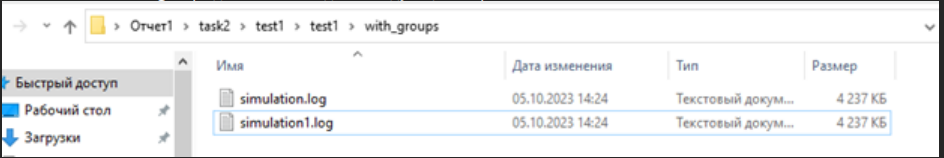
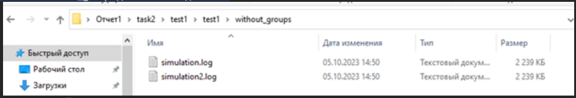
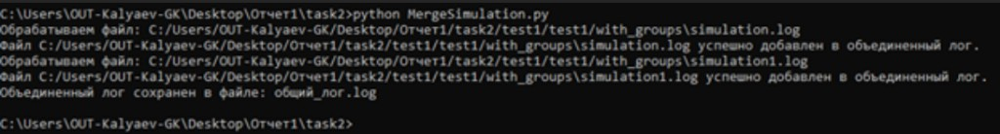
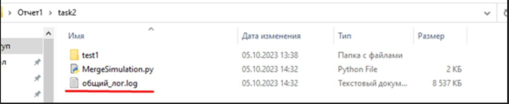
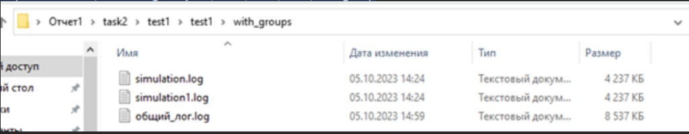
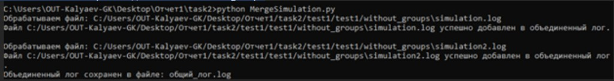
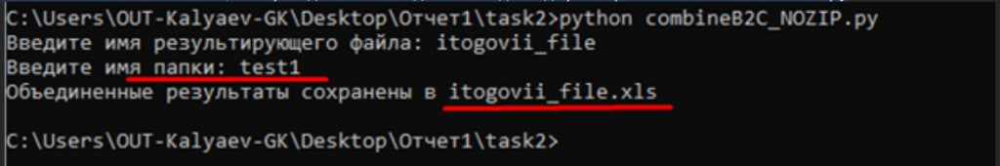
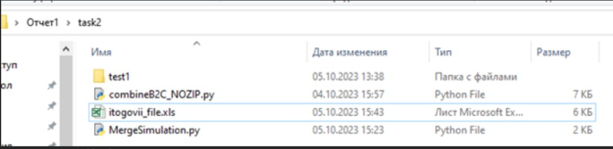
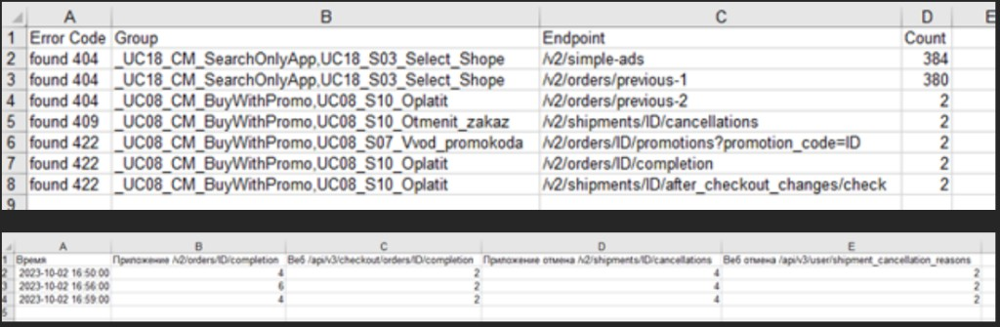

# Gatling reporting: log archive, Excel, two load generators

**[← Documentation](../../README.md)** · **[Русская версия](../ru/05-gatling-report-excel.md)**

This page summarizes a practical workflow: on **Linux**, package a **`<run>_full`** folder (logs **with** and **without** Gatling groups) and a zip; on **Windows**, build an **`.xls`** workbook with **Errors** and **Requests per min**; and how to merge runs from **two generators**.

**Scripts in the repo:** [`tools/reporting/`](../../tools/reporting/) — `reportsZip.sh`, `combineB2C.py`, `combineB2C_NOZIP.py`, `MergeSimulation.py`, [`requirements.txt`](../../tools/reporting/requirements.txt). The full PDF with screenshots stays in your local “Инструкция по построению отчета для Гатлинга” folder.

---

<a id="section-1-reportszip"></a>

## 1. Single generator: `reportsZip.sh`

The script is **interactive**. Run it on the host where the **Gatling bundle** lives (example: `gatling-charts-highcharts-bundle-3.9.5`) and **`results/`** contains the run folder (e.g. `debug-20231002164043692` with `simulation.log`).

1. Place `reportsZip.sh` next to the bundle (same level as `gatling-charts-highcharts-bundle-3.9.5`).

   

2. Run the script, e.g. `/home/g_kalyaev/reportsZip.sh` (if execute permission is missing, use `sh /home/g_kalyaev/reportsZip.sh`; adjust user and path).
3. When prompted for the **full path to the Gatling folder**, enter e.g. `/home/g_kalyaev/gatling-charts-highcharts-bundle-3.9.5`.
4. When prompted for the **full path to the results folder**, enter e.g. `/home/g_kalyaev/gatling-charts-highcharts-bundle-3.9.5/results/`.
5. When prompted for the **run folder name** (no trailing slash), enter the directory that contains **`simulation.log`**, e.g. `debug-20231002164043692`.

6. After the script finishes, under `…/gatling-charts-highcharts-bundle-3.9.5/results/` you should see a **`<name>_full` directory** and a **`<name>_full.zip`** archive (screenshot below for the same example run).

   

7. Download **`…_full.zip`** to your PC. The archive holds **`simulation.log`** in two forms: **with** Gatling groups and **without** (see **`with_groups`** and **`without_groups`** inside `_full`). The **grouped** report may **fail to build** if the log is very large and the generator runs **out of memory**.

Inside `<name>_full`:

- **`with_groups/`** — artifacts and **`simulation.log`** with groups;
- **`without_groups/`** — log **without** `GROUP` lines (filtered + second **reports-only** Gatling pass).

**Path caveat:** the “with groups” branch calls `sh ./gatling-charts-highcharts-bundle-3.9.5/bin/gatling.sh` from the **current working directory** after internal `cd` steps. The bundle folder name and location must match your install; change that line in `reportsZip.sh` or mirror the original layout. The “without groups” branch uses `${path}/bin/gatling.sh`.

Continue with section 2 on the PC.

---

## 2. Excel from one zip: `combineB2C.py`

**OS:** intended for **Windows** (log subpaths use `\\`).

1. Create a folder, put the downloaded **`…_full.zip`** archive and **`combineB2C.py`** inside (from [`tools/reporting/`](../../tools/reporting/) in the repo or your own copy).

2. In **CMD**, `cd` to that folder and run: `python combineB2C.py`. You need **Python 3** plus **`xlwt`** and **`pandas`**:

   ```text
   pip install xlwt pandas
   ```

   Or from the repo root: `pip install -r tools/reporting/requirements.txt` — see [`requirements.txt`](../../tools/reporting/requirements.txt).

3. When prompted for the **output file name** (Russian prompt: «Введите имя результирующего файла:»), enter a name **without extension** (example below: `statistika` → `statistika.xls`).

   

4. At the next prompt (**«Введите имя папки:»**), enter the **same base name as the zip file without the `.zip` extension** — one token, **no spaces** (e.g. `debug-20231002164043692_full` for `debug-20231002164043692_full.zip`). The script unpacks it and resolves `with_groups` / `without_groups` paths.

While running, it reads:

- `…/with_groups/simulation.log` — errors matching `error_codes_to_track`;
- `…/without_groups/simulation_without_groups.log` — successful **REQUEST** lines for hard-coded B2C endpoints.

**Sheets:** **Errors** (Error Code, Group, Endpoint, Count) and **Requests per min** (time bucket + four API columns). For **another API**, edit the `request` comparisons and column headers.

5. **CMD output:** after both answers, the script prints a line like `Объединенные результаты сохранены в statistika.xls` (file name from step 3). Below is a full session with both prompts and inputs.

   

6. **In the working folder**, after a successful run you get the **`.xls` report** (example: `statistika.xls` from step 3) and a **directory** with the **extracted** archive contents (e.g. `debug-20231002164043692_full` — same base name as `…_full.zip` without the extension). `combineB2C.py` and the original zip remain alongside.

   

7. Open the generated **Excel** file (e.g. `statistika.xls`) and confirm the sheets contain data.

8. The **Errors** sheet shows **error statistics for the whole run**: **Error Code**, **Group**, **Endpoint**, and **Count** — log error text, Gatling group, endpoint, and how often it occurred.

   

9. The **Requests per min** sheet is **requests-per-minute statistics** (**OK** lines from the no-groups log): a **time** column plus four tracked endpoints (app/web order completion, app/web shipment cancellation — headers match `combineB2C.py`).

   

---

## 3. Two generators: merge logs, then `combineB2C_NOZIP.py`

Build **`…_full.zip` on each** of the two generators ([§3.0](#section-3-0-reportszip)), **download both** archives, lay out logs on the PC, **merge** pairs, rename for `combineB2C_NOZIP.py`, then produce one `.xls`.

<a id="section-3-0-reportszip"></a>

### 3.0. On each generator: `reportsZip.sh` (error table from two hosts)

To merge statistics later, run the packaging steps **on every generator** (same flow as [section 1](#section-1-reportszip); the run folder name `debug-…` will be **different** on the second host).

1. Place **`reportsZip.sh`** next to **`gatling-charts-highcharts-bundle-3.9.5`** (see the screenshot in section 1).
2. Run e.g. `/home/g_kalyaev/reportsZip.sh` or `sh /home/g_kalyaev/reportsZip.sh`.
3. Gatling root path: `/home/g_kalyaev/gatling-charts-highcharts-bundle-3.9.5`.
4. Results path: `/home/g_kalyaev/gatling-charts-highcharts-bundle-3.9.5/results/`.
5. On **this** generator, enter the folder name that contains **`simulation.log`** (example: `debug-20231002164043692` — on the other generator use **its** folder for the paired run).
6. Under **`…/results/`** you get a **`<name>_full` directory** and **`<name>_full.zip`**. The screenshot shows another run id (`debug-20231002164039914`); your names match step 5.

   

Repeat steps **1–6 on the second generator**, then download **both** `…_full.zip` files to your PC.

### 3.1. Inside `_full`, download logs, PC folder layout (steps 7–16)

7. Under each **`debug-…_full`** directory (from the zip or on the host) you have **`without_groups`** and **`with_groups`**; each contains its own **`simulation.log`** (with and without Gatling groups).

8. Repeat on the **second** generator. You end up with **four** log files: one in **`with_groups`** and one in **`without_groups`** on **each** machine.

9. **Copy / download** all four logs to your PC (SFTP, WinSCP, etc.).

10. Create a working folder, e.g. **`task2`**, and place **[`MergeSimulation.py`](../../tools/reporting/MergeSimulation.py)** there.

11. Inside **`task2`**, create **`test1`**, then **another nested** folder also named **`test1`**, so the path is **`Report1\task2\test1\test1`** (top-level `Report1` is optional, match your layout).

12. Inside the **inner** **`test1`**, create **`with_groups`** and **`without_groups`**.

13. In **`with_groups`**, add **`simulation.log`** from generator **1** (`…_full/with_groups/`) and **`simulation.log`** from generator **2** (same path on the other host). Because names collide, **rename one** (example below: `simulation1.log`).

14. In **`without_groups`**, do the same for both **`without_groups`** logs; rename the second file if needed (e.g. **`simulation2.log`**).

15. **`with_groups`** should look like this: two log files side by side (**`simulation.log`** and **`simulation1.log`** in the example).

   

16. **`without_groups`** should look the same pattern: two logs (**`simulation.log`** and **`simulation2.log`** in the example) — one per generator.

   

Summary:

```text
Report1/task2/MergeSimulation.py
Report1/task2/test1/test1/with_groups/     simulation.log + simulation1.log
Report1/task2/test1/test1/without_groups/ simulation.log + simulation2.log   (secondary names — your choice)
```

### 3.2. `MergeSimulation.py` (steps 17–24)

17. In [`MergeSimulation.py`](../../tools/reporting/MergeSimulation.py), set **`input_folder`** to the folder that contains the **two logs for the first merge** — **`…/test1/test1/with_groups`**. Use **forward slashes** `/` even on Windows, e.g.:

   `C:/Users/OUT-Kalyaev-GK/Desktop/Отчет1/task2/test1/test1/with_groups`

   Adjust user and drive; the path must end at **`with_groups`**, not a file name.

18. In **CMD**, `cd` to **`task2`** (where the script lives) and run: `python MergeSimulation.py`. Output lists each **`*.log`** processed and a line that the merged file was saved. The file name comes from **`output_file`** in the script (repo default **`merged_simulation.log`**; the screenshot example uses **`общий_лог.log`** if you set that).

   

19. **After the first run**, the merged **with-groups** log appears **next to the script** in **`task2`** (when **`output_file`** is not an absolute path). The screenshot shows **`общий_лог.log`**; your file name matches **`output_file`** (repo default **`merged_simulation.log`**).

   

20. **`with_groups`:** move the merged file from **`task2`** (example: **`общий_лог.log`**; yours matches **`output_file`**) into **`Report1\task2\test1\test1\with_groups\`** — note the folder name is **`with_groups`** (with an **s**). The screenshot shows the intermediate state: original **`simulation.log`** / **`simulation1.log`** plus the copied merged log (**`общий_лог.log`**, size roughly the sum of the two sources). Then **delete** or move aside **`simulation.log`** and **`simulation1.log`**, and **rename** the merged file to **`simulation.log`** so **`with_groups`** contains **only** that one file for `combineB2C_NOZIP.py`.

   

21. **Same for `without_groups`:** in [`MergeSimulation.py`](../../tools/reporting/MergeSimulation.py), set **`input_folder`** to **`…/test1/test1/without_groups`** (forward slashes `/`, e.g. `C:/Users/…/Report1/task2/test1/test1/without_groups`). Make sure **`task2`** does not still contain a merged file with the same **`output_file`** name, or pick another **`output_file`** so you do not overwrite the wrong artifact. From **`task2`**, run **`python MergeSimulation.py`** — it merges **`simulation.log`** and **`simulation2.log`**, writing the merged file into **`task2`** (example: **`общий_лог.log`**).

   

22. **Move the no-group merge:** move **`общий_лог.log`** (or your **`output_file`**) from **`Report1\task2\`** into **`Report1\task2\test1\test1\without_groups\`** — this is the **second** `MergeSimulation.py` output.

23. **Finalize `with_groups`:** only **`simulation.log`** should remain in **`…\test1\test1\with_groups\`** — the merged with-groups log under that name. If **`simulation1.log`** or an extra merged file is still there after step 20, remove extras so the single file is **`simulation.log`**.

24. **Finalize `without_groups`:** only **`simulation_without_groups.log`** should remain in **`…\test1\test1\without_groups\`** — rename the merged file from step 22 and **delete** the original **`simulation.log`** and **`simulation2.log`**.

### 3.3. `combineB2C_NOZIP.py` (steps 25–29)

Unlike `combineB2C.py`, this script **does not** unpack a zip — it reads **`with_groups/simulation.log`** and **`without_groups/simulation_without_groups.log`** directly.

25. Place **[`combineB2C_NOZIP.py`](../../tools/reporting/combineB2C_NOZIP.py)** in **`Report1\task2\`** (next to the **`test1`** folder as in the layout above).

26. In **CMD**, `cd` to **`Report1\task2`** and run **`python combineB2C_NOZIP.py`**. When prompted for the **output file name**, enter a name **without extension** (example: **`itogovii_file`** → **`itogovii_file.xls`** on disk).

27. When prompted for the **folder name**, enter the **outer** folder that sits **next to** **`combineB2C_NOZIP.py`** — in the walkthrough that is **`test1`** (i.e. **`Report1\task2\test1\`**). In [`combineB2C_NOZIP.py`](../../tools/reporting/combineB2C_NOZIP.py), the code appends paths like **`test1\with_groups\…`** and **`test1\without_groups\…`** to that folder, so for a tree **`task2\test1\test1\with_groups`** typing a single **`test1`** is enough. The console then prints a line such as **`Объединенные результаты сохранены в itogovii_file.xls`**.

   

28. Under **`task2`**, next to **`combineB2C_NOZIP.py`**, you get **`itogovii_file.xls`** (or whatever name you entered in step 26 with a **`.xls`** extension). **`test1`**, **`MergeSimulation.py`**, and the rest of your layout stay alongside.

   

29. Open **`itogovii_file.xls`**: the **Errors** and **Requests per min** tabs show **combined statistics from both generators** (same column layout as section 2, steps 8–9).

   

---

## 4. Summary table by endpoints without groups (HTML, two generators, on server)

Instead of the Excel workflow: build a Gatling **HTML summary** from **no-group** logs on **two** generators.

1. On **one** generator, open **`…/gatling-charts-highcharts-bundle-3.9.5/results/debug-…_full/`** — the same run you packaged with **`reportsZip.sh`**. Example: `/home/g_kalyaev/gatling-charts-highcharts-bundle-3.9.5/results/debug-20231002164039914_full/`.

2. You should already see **`without_groups`** and **`with_groups`**.

3. Create a **third** folder at the same level, e.g. **`svodnaia_table`**.

   

Then copy **`without_groups/simulation_without_groups.log`** from this host into **`svodnaia_table`** (e.g. as **`simulation.log`**), copy the peer log from the other generator (`scp` or WinSCP; file names must match what your Gatling version expects for **reports-only**). Generate the report **from logs only**:

```bash
/path/to/gatling-charts-highcharts-bundle-3.9.5/bin/gatling.sh -nr -ro /path/to/results/debug-…_full/svodnaia_table/
```

File names inside **`svodnaia_table`** must match **`-ro`** for your Gatling version (guides vary, e.g. **`simulation.log`** plus a second file). If something fails, check the Gatling docs for **`gatling.sh -ro`**.

---

## 5. Limits and reusing for other projects

| Item | Note |
|------|------|
| Bundle path in `reportsZip.sh` | One branch uses a **fixed** relative bundle directory — adjust for your install. |
| `combineB2C*.py` | Error strings and **URLs** are B2C-specific; change for WebTours or other APIs. |
| `MergeSimulation.py` | Concatenation order follows **`os.walk`**; sort/rename files if order matters. |
| `.xls` | Uses **xlwt**; switching to xlsx needs a different library. |

---

*Educational repository, not production code.*
