# Manual Gatling load test run (Linux)

**[← Documentation](../../README.md)** · **[Русская версия](../ru/06-gatling-manual-run-linux.md)**

How to deploy data and simulations into the official Gatling **bundle** and start a run **by hand** (without the `gatlingautomation-master` script set). Full PDF with screenshots: **`Инструкция по запуску теста на Гатлинге (2).pdf`** in your Downloads folder.

Paths and class name (**`NewScripts.Debug`**, folder **`3.9.5_new`**) come from a real example — replace with your bundle path, user, and simulation FQN.

---

## 1. `user-files`: where resources and scripts go

1. On the load generator, open **`/home/g_kalyaev/gatling-charts-highcharts-bundle-3.9.5_new/user-files/`** (or your **`…/user-files/`** path inside the bundle).

   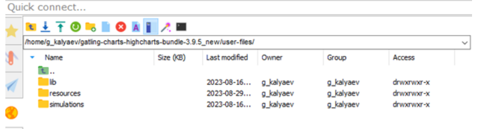

2. Copy **data pools** (CSV and other feeder assets) into **`user-files/resources/`**.

   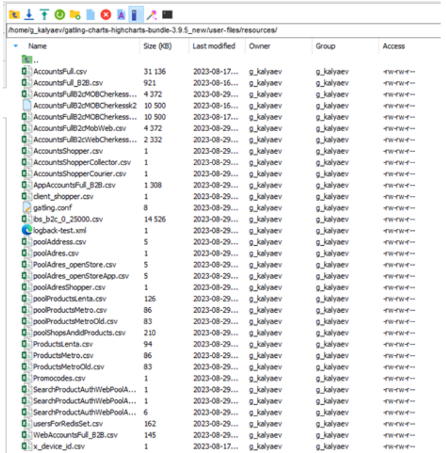

3. Copy **Scala simulations** into **`user-files/simulations/NewScripts/`**, including **`Debug.scala`**, **`HttpSberMarket.scala`**, and the rest of your project layout.

   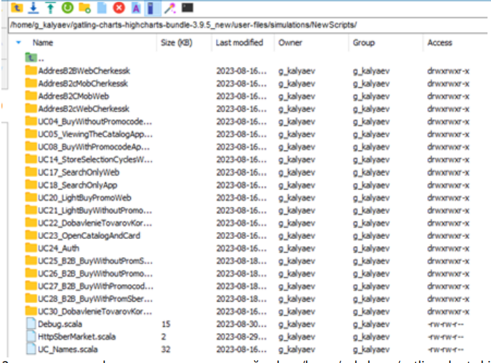

The **`-s NewScripts.Debug`** argument must match **`package` + object name** in **`Debug.scala`**.

---

## 2. Background launch and monitoring

4. Start **in the background** and write console output to a timestamped file:

```bash
nohup /home/g_kalyaev/gatling-charts-highcharts-bundle-3.9.5_new/bin/gatling.sh -bm -rm local -s NewScripts.Debug > $(date +%s)-g.out &
```

Adjust the path to **`gatling.sh`** and the simulation class (**`-s …`**).

5. Find the newest **`*-g.out`** file (from the directory where you launched the command, often home):

```bash
ls -t
```

The latest log is usually listed first.

   

6. **Watch** progress (replace **`1693350446-g.out`** with your file name):

```bash
tail -f 1693350446-g.out -n1000
```

- **`tail -f`** streams new lines as they appear;
- **`-n1000`** prints the **last 1000** lines first, then keeps following.

Press **Ctrl+C** to stop watching — Gatling **keeps running**.

   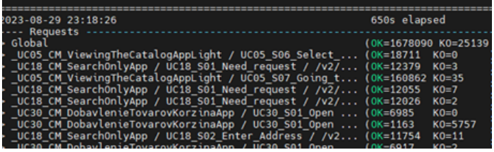

---

## 3. Stopping the test (emergency)

To **forcibly** stop Gatling processes on the host:

1. Become root: **`sudo -s`** (enter password when asked).

2. List matching processes:

```bash
ps aux | grep gatling | grep -v grep
```

   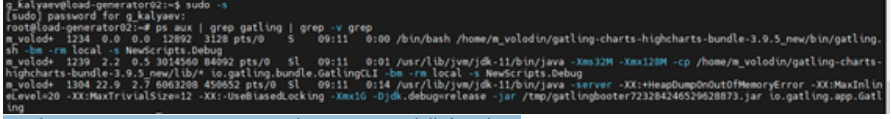

3. Kill them:

```bash
pkill -f 'gatling'
```

**Warning:** this stops **every** process whose command line contains **`gatling`**, including other users’ runs. On shared hosts prefer **`kill <PID>`** from step 2 for a surgical stop.

4. Run **`ps aux | grep gatling | grep -v grep`** again — there should be **no output**.

   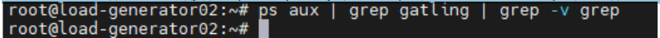

---

## 4. Manual report after a forced stop

If you stopped the run with **`pkill`** or it died abruptly, Gatling may not have produced the HTML report. Build it with **reports-only** (**`-ro`**) from the existing **`simulation.log`** under the run folder.

1. Open **`…/gatling-charts-highcharts-bundle-3.9.5_new/results/`** (your bundle’s **`results`** directory).

   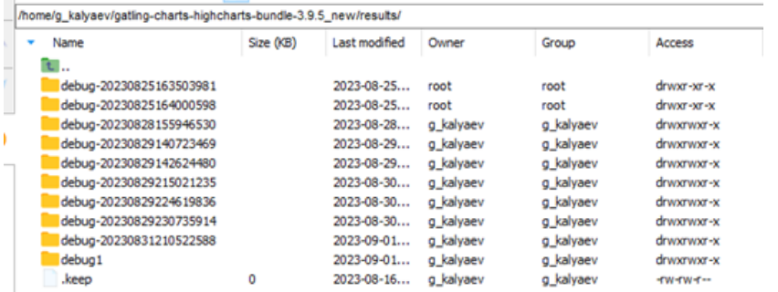

2. Pick the run folder **`debug-…`**. Inside you should see **`simulation.log`**.

   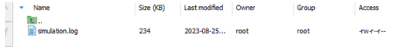

3. Run **`gatling.sh -ro`** with the **full path to that `debug-…` folder** (adjust user, bundle, and folder name):

```bash
/home/g_kalyaev/gatling-charts-highcharts-bundle-3.9.5_new/bin/gatling.sh -ro /home/g_kalyaev/gatling-charts-highcharts-bundle-3.9.5_new/results/debug-20230829215021235
```

Report generation can take a while.

4. When it finishes, **`index.html`** and related assets appear next to **`simulation.log`**. Open **`index.html`** in a browser.

   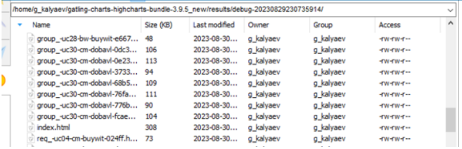

Confirm **`-ro`** argument rules (absolute path vs name under **`results`**) in your Gatling version’s docs.

---

## 5. Log analysis tips

### 5.1. Errors in **`simulation.log`** (under **`debug-…`**)

Work inside the folder that contains **`simulation.log`**, e.g.:

```bash
cd ~/gatling-charts-highcharts-bundle-3.9.5_new/results/debug-20230831210522588
```

**1.** Count endpoints for a status text such as **`found 500`**: print column 3, strip numeric path suffixes, **`uniq -c`**, sort by count:

```bash
date; cat simulation.log | grep "found 500" | awk '{print $3}' | sed 's/-[0-9]*//g' | sort | uniq -c | sort -h
```

Use the same pattern for **`found 404`**, **`found 429`**, etc. The screenshot uses **`found 429`**.

   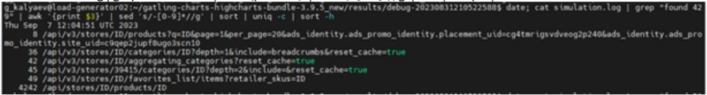

**2.** Non-OK **`REQUEST`** lines: take the error field (column 7 here) and aggregate:

```bash
cat simulation.log | grep REQUEST | grep -v OK | awk -F'\t' '{print $7}' | sort | uniq -c | sort
```

   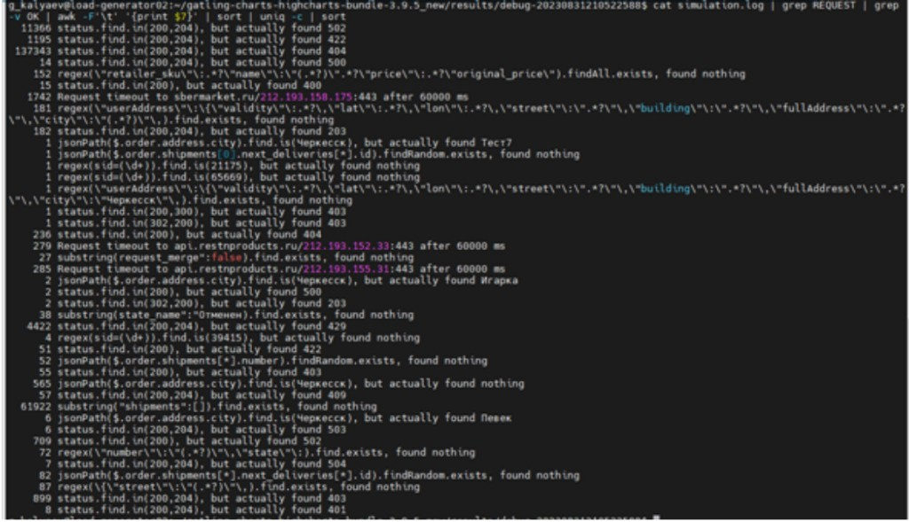

Log column layout depends on Gatling version; adjust **`awk`** if fields shift.

### 5.2. Large **`debug-…T….log`** at bundle root

**3.** Console logs like **`debug-20230829T215018.484.log`** sit in the bundle root next to **`bin`**, **`results`**, **`user-files`**.

   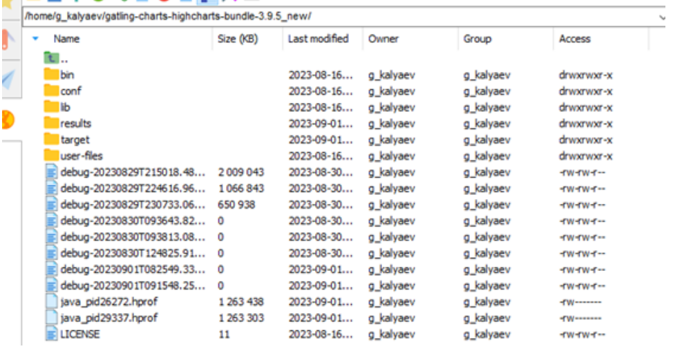

Example: **`found 404`** lines, aggregate, drop **`DEBUG`** (**`grep -P`** needs **GNU grep**; on macOS try **`ggrep`** or a different filter):

```bash
cd /home/g_kalyaev/gatling-charts-highcharts-bundle-3.9.5_new
grep -P "found 404" debug-20230710T191846.316.log | sort | uniq -c | sort | grep -v DEBUG
```

Replace the **`debug-….log`** file name with yours.

   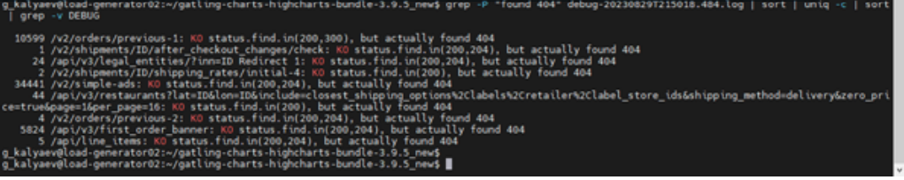

---

## 6. Related docs

- Git-driven automation: [Shell automation (Linux)](02-shell-automation-linux.md).
- Report zip / Excel workflow: [Gatling report: zip, Excel, two generators](05-gatling-report-excel.md).

---

*Educational repository, not production code.*
