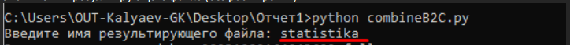
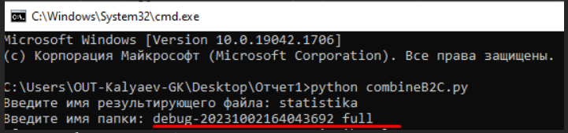
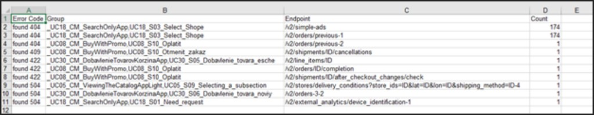
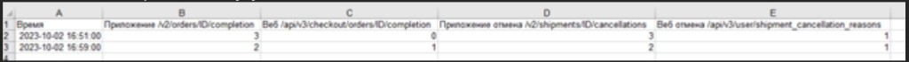

# Отчёт Gatling: архив логов, Excel, два генератора

**[← К документации](../../README.md)** · **[English version](../en/05-gatling-report-excel.md)**

Материал перенесён из рабочей инструкции: как на **Linux** собрать папку **`_full`** с логами (с группами и без), заархивировать, затем на **Windows** построить **`.xls`** с вкладками **Errors** и **Requests per min**, и как объединить результаты **двух генераторов**.

**Скрипты в репозитории:** [`tools/reporting/`](../../tools/reporting/) — `reportsZip.sh`, `combineB2C.py`, `combineB2C_NOZIP.py`, `MergeSimulation.py`, [`requirements.txt`](../../tools/reporting/requirements.txt). Полный PDF с скриншотами остаётся у вас локально (каталог «Инструкция по построению отчета для Гатлинга»).

---

<a id="section-1-reportszip"></a>

## 1. Один генератор: `reportsZip.sh`

Скрипт интерактивный: запускать на машине, где лежит **Gatling bundle** (в примере ниже — `gatling-charts-highcharts-bundle-3.9.5`) и каталог **`results/`** с папкой прогона (например `debug-20231002164043692` с `simulation.log`).

1. Положить `reportsZip.sh` рядом с bundle (как в исходной инструкции — на одном уровне с папкой `gatling-charts-highcharts-bundle-3.9.5`).

   

2. Запустить скрипт, например: `/home/g_kalyaev/reportsZip.sh` (если нет права на исполнение — `sh /home/g_kalyaev/reportsZip.sh`; подставьте свой пользователь и путь).
3. На запрос **полного пути в папку Gatling** ввести, например: `/home/g_kalyaev/gatling-charts-highcharts-bundle-3.9.5`.
4. На запрос **полного пути в папку results** ввести, например: `/home/g_kalyaev/gatling-charts-highcharts-bundle-3.9.5/results/`.
5. На запрос **имени папки с логом** ввести каталог прогона без слэша в конце, например `debug-20231002164043692`, внутри которого лежит **`simulation.log`**.

6. После выполнения скрипта в `…/gatling-charts-highcharts-bundle-3.9.5/results/` появятся **папка** `<имя>_full` и **архив** `<имя>_full.zip` (на скриншоте — пример для того же прогона).

   

7. Скачать на локальный ПК **`…_full.zip`**. В архиве доступны варианты **`simulation.log`**: с группировкой по группам Gatling и без неё (см. подкаталоги **`with_groups`** и **`without_groups`** внутри `_full`). Отчёт/лог **с группами** не всегда удаётся собрать: на генераторе может не хватить **памяти**, если файл очень большой.

Внутри `<имя>_full` ориентир такой:

- **`with_groups/`** — артефакты и **`simulation.log`** с группами;
- **`without_groups/`** — лог **без** строк `GROUP` (скрипт фильтрует и пересобирает отчёт через `gatling.sh -ro`).

**Важно про пути в скрипте:** ветка «отчёт с группами» вызывает `sh ./gatling-charts-highcharts-bundle-3.9.5/bin/gatling.sh` от **текущего каталога** после внутренних `cd`. Имя bundle и расположение должны совпадать с вашей установкой; при другой версии или пути — **отредактируйте** эту строку в `reportsZip.sh` или выровняйте структуру каталогов. Ветка «без групп» использует введённый путь `${path}/bin/gatling.sh`.

Дальше — раздел 2: работа с архивом на ПК.

---

## 2. Excel с одного архива: `combineB2C.py`

**ОС:** ориентир — **Windows** (в коде пути к логам заданы через `\\`).

1. Создать папку с любым именем и положить в неё **скачанный ранее архив** **`…_full.zip`** и скрипт **`combineB2C.py`** (из [`tools/reporting/`](../../tools/reporting/) репозитория или вашей копии).

2. В **CMD** перейти в эту папку и запустить: `python combineB2C.py`. Нужны установленные **Python 3** и библиотеки **`xlwt`** и **`pandas`**:

   ```text
   pip install xlwt pandas
   ```

   Либо одной командой из корня репозитория: `pip install -r tools/reporting/requirements.txt` (см. [`requirements.txt`](../../tools/reporting/requirements.txt)).

3. На запрос **«Введите имя результирующего файла:»** ввести имя **без расширения** (в примере ниже — `statistika`, на выходе будет `statistika.xls`).

   

4. На следующий запрос **«Введите имя папки:»** ввести **то же базовое имя, что у архива, но без расширения `.zip`** — одной строкой, **без пробела** внутри имени (например `debug-20231002164043692_full`, как у файла `debug-20231002164043692_full.zip`). Скрипт распакует zip и подставит пути к `with_groups` / `without_groups`.

При работе скрипт читает:

- `…/with_groups/simulation.log` — ошибки по кодам из списка `error_codes_to_track`;
- `…/without_groups/simulation_without_groups.log` — успешные **REQUEST** по зашитым эндпоинтам B2C (приложение/веб completion, отмены).

**Листы Excel:** **Errors** (Error Code, Group, Endpoint, Count) и **Requests per min** (время + четыре колонки по указанным путям API). Для **другого API** нужно править условия по `request` и заголовки колонок в скрипте.

5. **Результат в CMD:** после обоих вводов скрипт обрабатывает логи и выводит сообщение вида `Объединенные результаты сохранены в statistika.xls` (имя совпадает с шагом 3). Ниже — пример полной сессии: оба запроса и ответы.

   

6. **В рабочей папке** после успешного запуска появятся **файл отчёта** `.xls` (в примере — `statistika.xls`, имя задавалось на шаге 3) и **каталог** с **распакованным** содержимым архива — например `debug-20231002164043692_full` (то же базовое имя, что у `…_full.zip` без расширения). Рядом остаются исходные `combineB2C.py` и zip.

   

7. Открыть получившийся **Excel**-файл (например `statistika.xls`) и убедиться, что таблицы заполнены.

8. На листе **Errors** отображается **статистика по ошибкам за весь тест**: колонки **Error Code**, **Group**, **Endpoint**, **Count** — код/тип ошибки из лога, группа сценария Gatling, эндпоинт и число срабатываний.

   

9. На листе **Requests per min** — **статистика по запросам в минуту** (успешные **OK**-запросы из лога без групп): колонка **Время** и четыре эндпоинта — приложение/веб completion заказа, приложение/веб отмена доставки (заголовки совпадают с логикой в `combineB2C.py`).

   

---

## 3. Два генератора: слияние логов и `combineB2C_NOZIP.py`

Общая идея: на **каждом** из двух генераторов собрать архив **`…_full.zip`** ([п. 3.0](#section-3-0-reportszip)), **скачать оба** на ПК, разложить логи в одну структуру, **склеить** пары файлов, переименовать под ожидания `combineB2C_NOZIP.py`, затем собрать один `.xls`.

<a id="section-3-0-reportszip"></a>

### 3.0. На каждом генераторе: `reportsZip.sh` (таблица ошибок с двух машин)

Чтобы потом объединить статистику, **на каждом генераторе** отдельно выполните сбор (логика та же, что в [разделе 1](#section-1-reportszip); имя папки прогона `debug-…` на втором хосте будет **своим**).

1. Положить **`reportsZip.sh`** на один уровень с каталогом **`gatling-charts-highcharts-bundle-3.9.5`** (см. скриншот в разделе 1).
2. Запуск, например: `/home/g_kalyaev/reportsZip.sh` или `sh /home/g_kalyaev/reportsZip.sh`.
3. Полный путь в папку Gatling: `/home/g_kalyaev/gatling-charts-highcharts-bundle-3.9.5`.
4. Полный путь в папку results: `/home/g_kalyaev/gatling-charts-highcharts-bundle-3.9.5/results/`.
5. Имя папки с логом на **этом** генераторе, где лежит **`simulation.log`** (пример: `debug-20231002164043692` — на другом генераторе укажите **другую** папку того же прогона по времени).
6. После выполнения в **`…/results/`** появятся каталог **`<имя>_full`** и файл **`<имя>_full.zip`**. На скриншоте — пример с другим идентификатором прогона (`debug-20231002164039914`); у вас имена совпадут с вводом на шаге 5.

   

Повторите шаги **1–6 на втором генераторе**, затем скачайте **оба** `…_full.zip` на локальный ПК.

### 3.1. Структура папок (пример)

Удобный шаблон из инструкции:

```text
Отчет1/task2/test1/test1/with_groups/     ← simulation.log + simulation1.log (с двух генераторов)
Отчет1/task2/test1/test1/without_groups/   ← simulation.log + simulation2.log
```

Имена вторых файлов могут отличаться; главное — затем получить **один** объединённый лог в каждой ветке.

### 3.2. `MergeSimulation.py`

1. В [`MergeSimulation.py`](../../tools/reporting/MergeSimulation.py) задать **`input_folder`** на каталог с логами (в инструкции — прямой путь с **прямыми слэшами** `/`).
2. Запуск из удобного каталога: `python MergeSimulation.py` — появится файл с именем **`output_file`** (в репозитории по умолчанию `merged_simulation.log`).

Повторите для **`with_groups`** и для **`without_groups`**: в каждой папке в итоге должен остаться **один** лог с нужным именем:

- в **`with_groups`**: переименовать объединённый файл в **`simulation.log`**;
- в **`without_groups`**: переименовать в **`simulation_without_groups.log`** (как в исходной инструкции).

### 3.3. `combineB2C_NOZIP.py`

Отличие от `combineB2C.py`: **архив не распаковывается** — ожидается уже готовая папка (например `test1` с подкаталогами `with_groups` и `without_groups`).

1. Положить скрипт на уровень **родителя** папки с логами (в примере: `Отчет1/task2/` рядом с каталогом `test1`).
2. `python combineB2C_NOZIP.py` → имя **`.xls`** → имя папки (**без** `.zip`), например `test1`.

В **`test1/test1/...`** путь в инструкции был вложенным; подставьте **то имя папки**, в которой лежат `with_groups` и `without_groups`, как вы её реально создали.

Итоговый файл содержит те же вкладки **Errors** и **Requests per min**, но по **объединённым** логам двух генераторов.

---

## 4. Сводный HTML по эндпоинтам без групп (два генератора, на сервере)

Альтернатива «только Excel»: на одном из генераторов в каталоге `…_full/` создать папку (например `svodnaia_table`), скопировать туда `without_groups/simulation_without_groups.log` с **этого** хоста, второй лог — с другого генератора (`scp` или WinSCP), затем сгенерировать отчёт **только из логов**:

```bash
/path/to/gatling-charts-highcharts-bundle-3.9.5/bin/gatling.sh -nr -ro /path/to/results/debug-…_full/svodnaia_table/
```

Имена файлов в `svodnaia_table` должны быть согласованы с тем, как Gatling ожидает вход для **reports-only** (в инструкции встречались варианты вроде `simulation.log` и второго файла с другим именем). При расхождении со скриншотами проверьте документацию вашей версии Gatling для **`-ro`**.

---

## 5. Ограничения и перенос на другие проекты

| Что | Замечание |
|-----|-----------|
| Версия Gatling в `reportsZip.sh` | Жёстко зашито имя каталога bundle в одной из команд — править под свою установку. |
| `combineB2C*.py` | Список HTTP-кодов и **конкретные URL** — под сценарий B2C; для WebTours или другого API заменить. |
| `MergeSimulation.py` | Склейка **в порядке обхода** файлов `os.walk`; при необходимости зафиксируйте порядок вручную. |
| Формат `.xls` | Библиотека **xlwt**; для xlsx понадобится другой стек. |

---

*Учебный репозиторий, не продакшен-код.*
